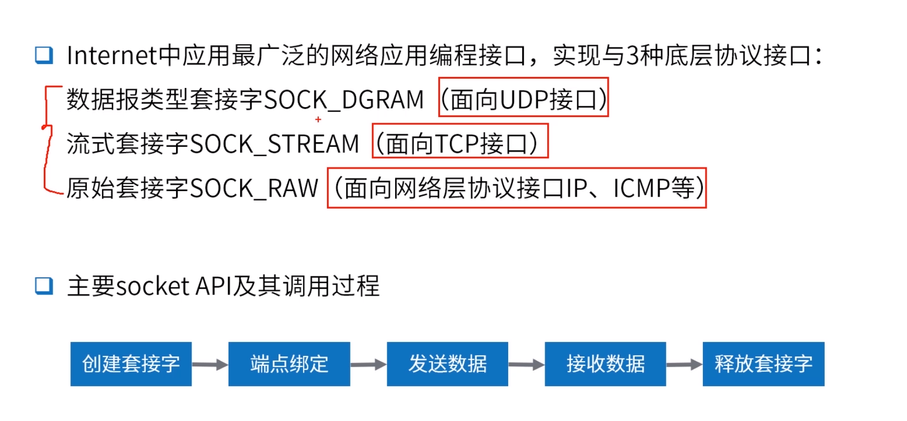
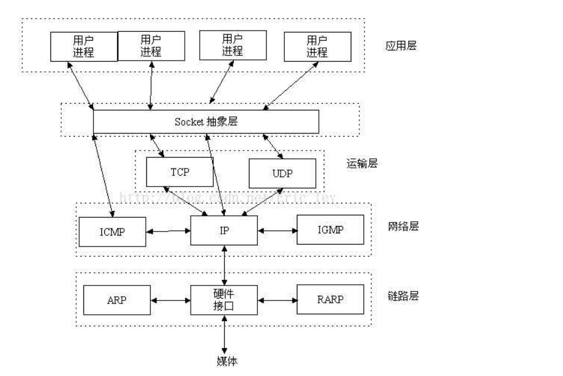
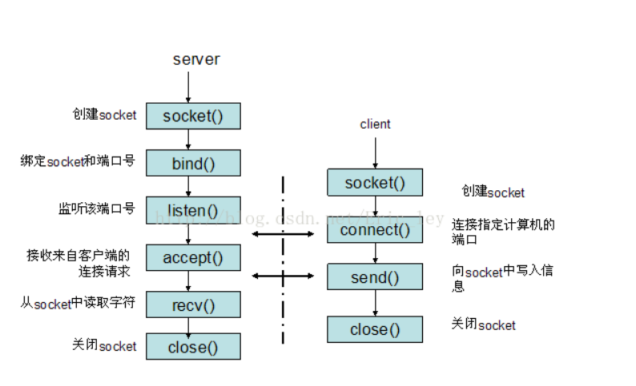

IP层的ip地址可以唯一标示主机，而TCP层协议和端口号可以唯一标示主机的一个进程，这样我们可以利用ip地址＋协议＋端口号唯一标示网络中的一个进程。

能够唯一标示网络中的进程后，它们就可以利用socket进行通信了

**socket是在应用层和传输层之间的一个抽象层，它把TCP/IP层复杂的操作抽象为几个简单的接口供应用层调用已实现进程在网络中通信**如下图所示



以使用TCP协议通讯的socket为例，其交互过程大致是：



javasocket编程：

客户端：

````java
    public static void main(String[] args) {
        try {
            Socket socket = new Socket("localhost",8080);
            OutputStream outputStream = socket.getOutputStream();
            Scanner s = new Scanner(System.in);
            System.out.println("请输入");
            String s1 = s.nextLine();
            outputStream.write(s1.getBytes());
            s.close();
            socket.close();
        } catch (IOException e) {
            e.printStackTrace();
        }
    }
````

服务端

````java
    public static void main(String[] args) {
        Socket request = null;
        try {
            ServerSocket serverSocket = new ServerSocket(8080);
            System.out.println("服務器啟動完成");
            while (!serverSocket.isClosed()){
                //阻塞
                 request = serverSocket.accept();
                System.out.println("收到新的连接："+request.toString());
                InputStream inputStream = request.getInputStream();
                BufferedReader reader = new BufferedReader(new InputStreamReader(inputStream, StandardCharsets.UTF_8));
                String msg;
                while ((msg = reader.readLine()) != null){
                    System.out.println(msg);
                }
                System.out.println("收到数据，来自:" + request.toString());
            }
        } catch (IOException e) {
            e.printStackTrace();
        }finally {
            if(null != request){
                try {
                    request.close();
                } catch (IOException e) {
                    e.printStackTrace();
                }
            }
        }
    }
````

*accept是阻塞的只有当处理完当前的请求才能迎接下一个*

````java
    // 创建一个 核心线程数量为5，最大数量为10,等待队列最大是3 的线程池，也就是最大容纳13个任务。
    private static ThreadPoolExecutor threadPoolExecutor = new ThreadPoolExecutor(5, 10, 5, TimeUnit.SECONDS, new LinkedBlockingQueue<>(3), new RejectedExecutionHandler() {
        @Override
        public void rejectedExecution(Runnable r, java.util.concurrent.ThreadPoolExecutor executor) {
            System.err.println("有任务被拒绝了");
        }
    });

    public static void main(String[] args) {
        try {
            ServerSocket serverSocket = new ServerSocket(8080);
            System.out.println("服务器启动成功");
            while (!serverSocket.isClosed()) {
                //阻塞
                Socket request = serverSocket.accept();
                System.out.println("收到新连接 : " + request.toString());
                Future<?> submit = threadPoolExecutor.submit(() -> {
                    try {
                        InputStream inputStream = request.getInputStream();
                        BufferedReader bufferedReader = new BufferedReader(new InputStreamReader(inputStream, StandardCharsets.UTF_8));
                        String msg = "";
                        while ((msg = bufferedReader.readLine()) != null) {
                            if (msg.length() == 0) {
                                break;
                            }
                            System.out.println(msg);
                        }
                        System.out.println("收到数据,来自：" + request.toString());
                    } catch (IOException e) {
                        e.printStackTrace();
                    } finally {
                        try {
                            request.close();
                        } catch (IOException e) {
                            e.printStackTrace();
                        }
                    }
                });
            }
        } catch (IOException e) {
            e.printStackTrace();
        }
    }
````

*可以开多个线程来执行*

````java
 // 创建一个 核心线程数量为5，最大数量为10,等待队列最大是3 的线程池，也就是最大容纳13个任务。
    private static ThreadPoolExecutor threadPoolExecutor = new ThreadPoolExecutor(5, 10, 5, TimeUnit.SECONDS, new LinkedBlockingQueue<>(3), new RejectedExecutionHandler() {
        @Override
        public void rejectedExecution(Runnable r, java.util.concurrent.ThreadPoolExecutor executor) {
            System.err.println("有任务被拒绝了");
        }
    });

    public static void main(String[] args) {
        try {
            ServerSocket serverSocket = new ServerSocket(8080);
            System.out.println("服务器启动成功");
            while (!serverSocket.isClosed()) {
                //阻塞
                Socket request = serverSocket.accept();
                System.out.println("收到新连接 : " + request.toString());
                Future<?> submit = threadPoolExecutor.submit(() -> {
                    try {
                        InputStream inputStream = request.getInputStream();
                        BufferedReader bufferedReader = new BufferedReader(new InputStreamReader(inputStream, StandardCharsets.UTF_8));
                        String msg = "";
                        while ((msg = bufferedReader.readLine()) != null) {
                            if (msg.length() == 0) {
                                break;
                            }
                            System.out.println(msg);
                        }
                        System.out.println("收到数据,来自：" + request.toString());
                        // 响应结果 200
                        OutputStream outputStream = request.getOutputStream();
                        outputStream.write("HTTP/1.1 200 OK\r\n".getBytes());
                        outputStream.write("Content-Length: 11\r\n\r\n".getBytes());
                        outputStream.write("Hello World".getBytes());
                        outputStream.flush();
                    } catch (IOException e) {
                        e.printStackTrace();
                    } finally {
                        try {
                            request.close();
                        } catch (IOException e) {
                            e.printStackTrace();
                        }
                    }
                });
            }
        } catch (IOException e) {
            e.printStackTrace();
        }
    }
````

*http协议是基于TCP协议的超文本传输协议，HTTP连接最显著的特点是客户端发送的每次请求都需要服务器回送响应，在请求结束后，会主动释放连接。从建立连接到关闭连接的过程称为“一次连接”*

````java
 // 创建一个 核心线程数量为5，最大数量为10,等待队列最大是3 的线程池，也就是最大容纳13个任务。
    private static ThreadPoolExecutor threadPoolExecutor = new ThreadPoolExecutor(5, 10, 5, TimeUnit.SECONDS, new LinkedBlockingQueue<>(3), new RejectedExecutionHandler() {
        @Override
        public void rejectedExecution(Runnable r, java.util.concurrent.ThreadPoolExecutor executor) {
            System.err.println("有任务被拒绝了");
        }
    });

    public static void main(String[] args) {
        try {
            ServerSocket serverSocket = new ServerSocket(8080);
            System.out.println("服务器启动成功");
            while (!serverSocket.isClosed()) {
                //阻塞
                Socket request = serverSocket.accept();
                System.out.println("收到新连接 : " + request.toString());
                Future<?> submit = threadPoolExecutor.submit(() -> {
                    try {
                        InputStream inputStream = request.getInputStream();
                        BufferedReader bufferedReader = new BufferedReader(new InputStreamReader(inputStream, StandardCharsets.UTF_8));
                        String msg = "";
                        while ((msg = bufferedReader.readLine()) != null) {
                            if (msg.length() == 0) {
                                break;
                            }
                            System.out.println(msg);
                        }
                        System.out.println("收到数据,来自：" + request.toString());
                        // 响应结果 200
                        OutputStream outputStream = request.getOutputStream();
                        outputStream.write("HTTP/1.1 200 OK\r\n".getBytes());
                        outputStream.write("Content-Length: 11\r\n\r\n".getBytes());
                        outputStream.write("Hello World".getBytes());
                        outputStream.flush();
                    } catch (IOException e) {
                        e.printStackTrace();
                    } finally {
                        try {
                            request.close();
                        } catch (IOException e) {
                            e.printStackTrace();
                        }
                    }
                });
            }
        } catch (IOException e) {
            e.printStackTrace();
        }
    }
````


