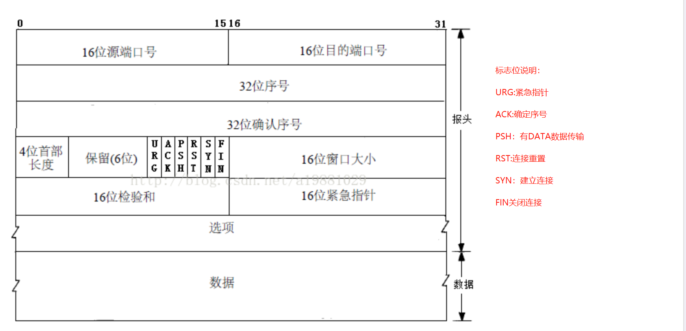

### 传输控制协议TCP：

**TCP报文**

**IP报**

**TCP报头**中的源端口号和目的端口号同**IP数据报**中的源IP与目的IP唯一确定一条TCP连接。

序号（4字节=32位）：

  37 59 56 75

  用来标识TCP发端向TCP收端发送的数据字节流

确认序号（4字节=32位）：

  **由于该报文为SYN报文，ACK标志为0，故没有确认序号（ACK标志为1时确认序号才有效）TCP协议规定，只有ACK=1时有效，也规定连接建立后所有发送的报文的ACK必须为1**

  一旦连接建立，该值将始终发送（同ACK标志）

头部长度：该字段占用4位，用来表示报文首部的长度，单位是4Byte。如：headLen = ((packet[12]>>4)&0x0F)*4;

预留6位：长度为6位，作为保留字段，暂时没有什么用处。

 

URG：长1位，表示紧急指针字段有效；

ACK：长1位，**置位表示确认号字段有效；****TCP协议规定，只有ACK=1时有效，也规定连接建立后所有发送的报文的ACK必须为1**

PSH：长1位，表示当前报文需要请求推（push）操作；

RST：长1位，置位表示复位TCP连接；

SYN：长1位，在连接建立时用来同步序号。当SYN=1而ACK=0时，表明这是一个连接请求报文。对方若同意建立连接，则应在响应报文中使SYN=1和ACK=1. 因此,SYN置1就表示这是一个连接请求或连接接受报文。

FIN：长1位，用于释放TCP连接时标识发送方比特流结束；即完，终结的意思， 用来释放一个连接。当 FIN = 1时，表明此报文段的发送方的数据已经发送完毕，并要求释放连接。

窗口大小：长度为16位，2个字节。

校验和：长度为16位，2个字节。

紧急指针：长度为16位，2个字节。

以上是TCP包头必须要有的字段，也称固有字段，长度为20个字节。

### TCP三次握手，四次挥手

###### 三次握手

1. 第一次握手：主机A发送位码为syn＝1，随机产生seq number=1234567的数据包到服务器，主机B由SYN=1知道，A要求建立联机；
2. 第二次握手：主机B收到请求后要确认联机信息，向A发送ack number=(主机A的seq+1)，syn=1，ack=1，随机产生seq=7654321的包；
3. 第三次握手：主机A收到后检查ack number是否正确，即第一次发送的seq number+1，以及位码ack是否为1，若正确，主机A会再发送ack number=(主机B的seq+1)，ack=1，主机B收到后确认seq值与ack=1则连接建立成功。

###### 四次挥手

1. 第一次分手：主机1（可以使客户端，也可以是服务器端），设置`Sequence Number`和`Acknowledgment Number`，向主机2发送一个`FIN`报文段；此时，主机1进入`FIN_WAIT_1`状态；这表示主机1没有数据要发送给主机2了；
2. 第二次分手：主机2收到了主机1发送的`FIN`报文段，向主机1回一个`ACK`报文段，`Acknowledgment Number`为`Sequence Number`加1；主机1进入`FIN_WAIT_2`状态；主机2告诉主机1，我已经知道你没有数据要发送了；
3. 第三次分手：主机2向主机1发送`FIN`报文段，请求关闭连接，同时主机2进入`CLOSE_WAIT`状态；
4. 第四次分手：主机1收到主机2发送的`FIN`报文段，向主机2发送`ACK`报文段，然后主机1进入`TIME_WAIT`状态；主机2收到主机1的`ACK`报文段以后，就关闭连接；此时，主机1等待2MSL后依然没有收到回复，则证明Server端已正常关闭，那好，主机1也可以关闭连接了。

### UDP

​	音视频聊天，物联网日志上报