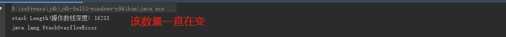

**线程独占**：每个线程都会有它独立的空间，随**线程的生命周期**而创建和销毁

**线程共享**：所有线程能访问这块内存数据，随**虚拟机或者GC**而创建和销毁


| 区域       | 功能                                                     | 备注                                                         |
| ---------- | -------------------------------------------------------- | ------------------------------------------------------------ |
| 方法区     | 存储**加载的类信息、常量、静态变量、编译后的代码**等数据 | 逻辑区域(没有具体的实现的硬性规定，具体实现更具不同虚拟机来实现 |
| 堆内存     | java启动时创建，存放对象的实例                           | 分为：**老年代、新生代**（Eden、From Survivor、To Survivor)。满了：抛OutOfMemoryError |
| 虚拟机栈   |                                                          |                                                              |
| 本地方法栈 |                                                          |                                                              |
| 程序计数器 | 记录某个线程的字节码的执行位置                           | 1、线程隔离性，每个线程工作都有属于自己的独立计数器。2、执行java方法，记录正在执行的字节码指令的地址，数据在jvm内存上进行分配。3、执行native方法，计数器为空（Undefined)，其数据在C内存模型上分配。 |

### 虚拟机栈

缺少：网易的图片！！！

虚拟机栈由多个栈帧组成，每个栈帧对应一个方法。每个java方法在执行时，会创建一个“栈帧（stack frame）”。上图中的操作数栈深度只是代表main方法一个栈帧的的深度。

当单个线程的请求栈深度大于虚拟机允许的最大栈深度，则会抛出StackOverflowError(栈溢出)。

````java
package com.example.demo.thread.jvm;

/**
 * Author：cc
 *
 * @author cc
 * Date：2020-06-17 15:52
 * Description：<描述>
 */
public class StackOverFlowError {

    private int stackLength = -1;

    public void stackLeak(){
        stackLength++;
        stackLeak();
    }

    public static void main(String[] args) {
        StackOverFlowError stackOverFlowError = new StackOverFlowError();
        try {
            stackOverFlowError.stackLeak();
        } catch (Throwable e) {
            System.out.println("stack Length(栈深度):" + stackOverFlowError.stackLength);
            System.out.println(e);
        }
    }

}

````

结果：




栈内存耗尽

````java
package com.example.demo.thread.jvm.outOfMemoryError;

/**
 * Author：cc
 *
 * @author cc
 * Date：2020-06-17 16:24
 * Description：<描述>
 */
public class Stack {

    private void dontStop() {
        //线程的run方法不停止
        while (true) {
        }
    }

    public void stackLeakByThread() {
        //一直创建新的线程
        while (true) {
            // java8 lambda 表达式 将函数作为方法参数传入，执行其中的
            Thread thread = new Thread(() -> dontStop());
            thread.start();
        }
    }

    public static void main(String[] args) {
        Stack stack = new Stack();
        stack.stackLeakByThread();
    }
}

````


