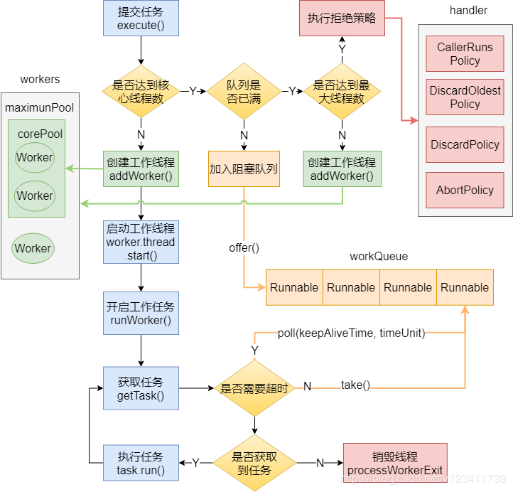
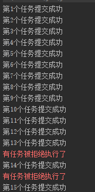
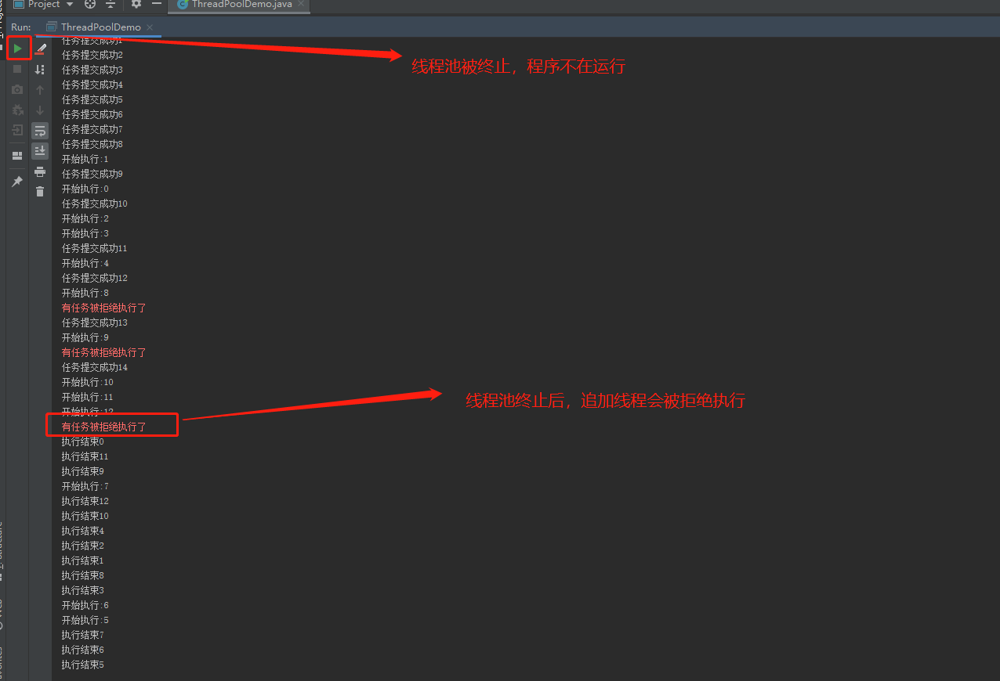
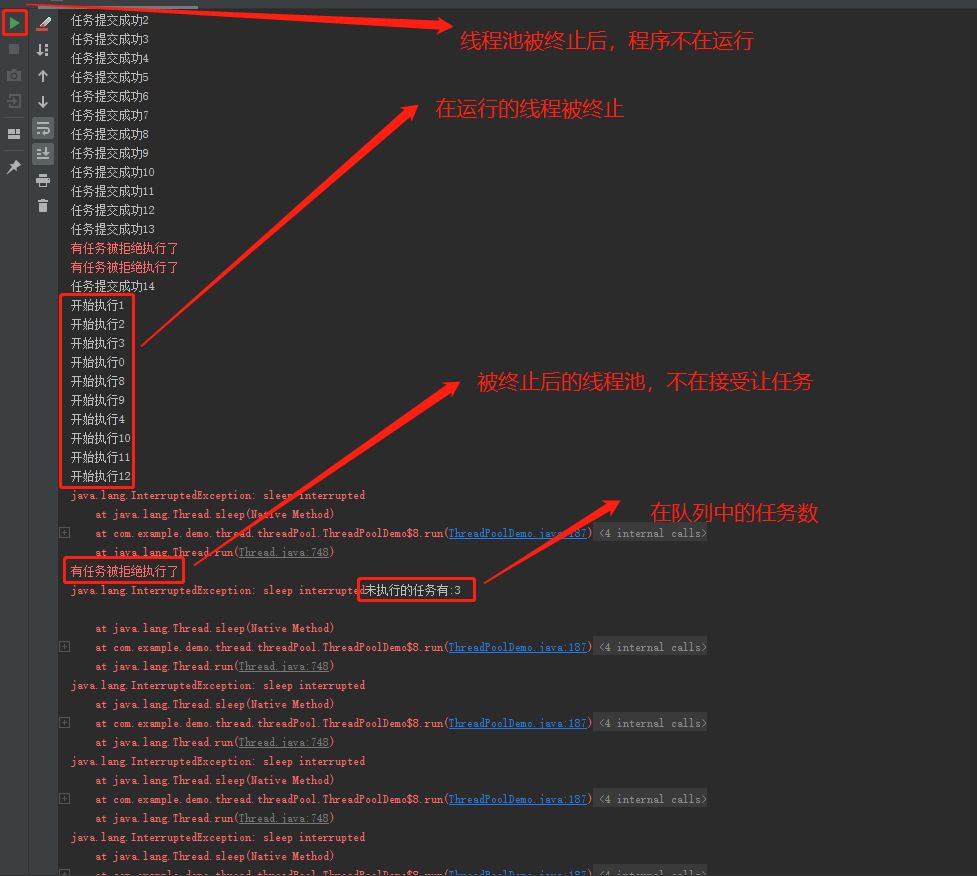

https://www.jianshu.com/p/125ccf0046f3

[http://www.ideabuffer.cn/2017/04/04/%E6%B7%B1%E5%85%A5%E7%90%86%E8%A7%A3Java%E7%BA%BF%E7%A8%8B%E6%B1%A0%EF%BC%9AThreadPoolExecutor/#addWorker%E6%96%B9%E6%B3%95](http://www.ideabuffer.cn/2017/04/04/深入理解Java线程池：ThreadPoolExecutor/#addWorker方法)

https://www.cnblogs.com/wang-meng/p/10163855.html

````java
ThreadPoolExecuter(
    //核心线程池的大小，当提交一个任务时，如果当前核心线程池的线程个数没有达到corePoolSize时，则会创建新的线程来执行所提交的任务（即使当前核心线程池有空闲线程）,直至创建的线程数达到当前的核心线程数，则不再创建线程。
    int corePoolSize,
    //表示能创建线程线程的最大个数。如果当阻塞队列已满时，并且当线程池线程个数没有超过maximunPoolSize，就会创建新的线程来执行任务
    int maximumPoolSize,
    //空闲线程存活时间。如果当前线程池的线程个数已经超过corePoolSize,并且线程空闲时间超过了keepAliveTime的话，那么这些线程将被销毁
    long keepAliveTime,
    //时间单位，为keepAliveTime指定时间单位
    TimeUnit unit,
    //阻塞队列。用于保存任务的阻塞队列。可以使用 ArrayBlockingQueue,LinkedBlockingQueue,SynchronousQueue,PriorityBlockingQueue
    BlockingQueue<Runable> workQueue,
    //创建线程的工厂类。可以通过指定线程工厂为每个创建出来的线程设置更有意思的名字，如果出现并发问题，方便查找问题
    ThreadFactory threadFactory,
    //拒绝（饱和）策略。当线程的阻塞队列已满和指定的线程都已经开启，说明当前线程池已经处于饱和状态了，那么就需要采用一种策略来处理。有以下几种策略
    //1、AbortPolicy:直接拒绝所提交的任务，并抛出RejectedExecutionException异常;
    //2、CallerRunsPolicy:只用调用者所在的线程来执行任务
    //3、DiscardPolicy:不处理直接丢弃掉任务
    //4.DiscardOldestPolicy:丢弃掉阻塞队列中存放时间最久的任务，执行当前任务
    RejectedExecutionHandler handler
)
````



可以看出，execute方法的的执行逻辑为：

1. 如果当前运行的线程少于corePoolSize时，不论当前核心线程内是否有空闲线程，都会创建新的线程来执行当前任务。
2. 如果达到了核心线程数，则判断当前阻塞队列（workQueue）是否已满
3. 若阻塞队列已满，则会判断当前线程池中的线程是否达到了最大线程数。
4. 若未达到当前最大线程数，则创建新的线程来执行当前的任务
5. 若已达到当前的最大线程数，则执行拒绝策略
6. 若阻塞队列未满，则将当前任务加入阻塞队列
7. 

### 线程池测试：

````java
package com.example.demo.thread.threadPool;

import java.util.concurrent.ThreadPoolExecutor;

/**
 * Author：cc
 *
 * @author cc
 * Date：2020-06-22 13:50
 * Description：<描述>
 */
public class TestCommon {

    /**
     * 创建15个，执行时间需要3s的任务
     *
     * @param threadPoolExecutor
     */
    public static void testCommon(ThreadPoolExecutor threadPoolExecutor) throws InterruptedException {
        for (int i = 0; i < 15; i++) {
            int finalI = i + 1;
            threadPoolExecutor.submit(new Runnable() {
                @Override
                public void run() {
                    try {
                        System.out.println("开始执行:" + finalI);
                        Thread.sleep(3000L);
                        System.out.println("执行结束:" + finalI);
                    } catch (InterruptedException e) {
                        e.printStackTrace();
                    }

                }
            });
            System.out.println("第" + finalI + "个任务提交成功");
        }
        Thread.sleep(300L);
        System.out.println("当前线程池的线程总数量:" + threadPoolExecutor.getPoolSize());
        System.out.println("当前正在队列中等待执行的任务数:" + threadPoolExecutor.getQueue().size());

        Thread.sleep(15000L);
        System.out.println("当前线程池的线程总数量:" + threadPoolExecutor.getPoolSize());
        System.out.println("当前正在队列中等待执行的任务数:" + threadPoolExecutor.getQueue().size());
    }
}

````

- Test01:

  ````java
      /**
       * 1、线程池信息：核心线程数量5，最大线程数量10，无界队列，超出核心线程数量的线程存活时间：5s
       */
      private void threadPoolExecutor1() throws InterruptedException {
          ThreadPoolExecutor threadPoolExecutor = new ThreadPoolExecutor(5,10,5, TimeUnit.SECONDS,new LinkedBlockingQueue<>());
          TestCommon.testCommon(threadPoolExecutor);
      }
  ````

  结果：

  当任务全部提交成功后，线程池的线程总量为5。在队列中等待执行的任务数为10。

  当任务全部执行结束之后，线程池的线程总量为5。在队列中等待执行的任务为0。

- Test02

  ````java
      /**
       * 线程池信息：核心线程数量5，最大线程数量10，队列大小3，超出核心线程数量的线程存活时间为5s，指定拒绝策略
       * 最大容纳13个任务，超出的任务则拒绝执行
       * 使用默认拒绝策略会抛出RejectedExecutionException
       */
      private void threadPoolExecutor2() throws InterruptedException {
          ThreadPoolExecutor threadPoolExecutor = new ThreadPoolExecutor(5, 10, 5, TimeUnit.SECONDS, new LinkedBlockingQueue<>(3), new RejectedExecutionHandler() {
              @Override
              public void rejectedExecution(Runnable r, ThreadPoolExecutor executor) {
                  System.err.println("有任务被拒绝执行了");
              }
          });
          TestCommon.testCommon(threadPoolExecutor);
      }
  ````

  结果：

  - 有两个任务被拒绝执行了

    

  - 当任务全部执行结束之后，线程池的线程总量为5。在队列中等待执行的任务为0。

- Test03

  ````java
      /**
       * 线程池信息：核心线程数量5，最大线程数量5，无界队列，超出核心线程数的线程的存活时间：5s
       */
      private void threadPoolExecutor3() throws InterruptedException {
          //和Executors.newFixedThreadPool(int nThreads) 的效果一样
          ThreadPoolExecutor threadPoolExecutor = new ThreadPoolExecutor(5,5,0,TimeUnit.SECONDS,new LinkedBlockingQueue<>());
          TestCommon.testCommon(threadPoolExecutor);
      }
  ````

  结果：

  核心线程数量为5，超出数量的任务，在队列中等待被执行

- Test04

  线程的三种队列

  - SynchrinousQueue：没有容量，是无缓冲等待队列，是一个不存储元素的阻塞队列，会直接将任务交给消费者，必须等队列中的添加元素被消费后才能继续添加新的元素。

  - LinkedBlockingQueue：通常称为无界缓存等待队列。当前执行的线程数量达到corePoolSize的数量时，剩余的元素会在阻塞队列里等待。（使用此队列时，maximunPoolSize就相当于无效）,每个线程完全独立于其他线程。**生产者和消费者使用独立的锁来控制数据的同步，即在高并发的情况下可以并行操作队列中的数据。**

    也可以人为指定队列大小

  - ArrayBlockingQueue：有界缓存等待队列，可以指定缓存队列的大小。

    ````java
    new ArrayBlockingQueue<>(32)
    ````

  ````java
      /**
       * 线程池信息：核心线程数量为0，最大线程数量Integer.Max_Value,SynchronousQueue队列，超出核心线程数量的线程存活时间为60s
       */
      private void threadPoolExecutor4() throws InterruptedException {
          ThreadPoolExecutor threadPoolExecutor = new ThreadPoolExecutor(0,Integer.MAX_VALUE,60,TimeUnit.SECONDS,new SynchronousQueue<>());
          TestCommon.testCommon(threadPoolExecutor);
          //60s后再看看线程池的线程数量 --> 0
          Thread.sleep(60000L);
          System.out.println(threadPoolExecutor.getPoolSize());
      }
  ````

- Test05

  定时线程

  ````java
      /**
       * 定时执行线程池信息：3s后执行,一次性任务,到点就执行
       * 核心线程数量5,最大数量Integer.MAX_VALUE,DelayedWorkQueue延时队列，超出核心线程数量的线程的存货时间为：0秒
       */
      private void threadPoolExecutor5(){
          ScheduledThreadPoolExecutor threadPoolExecutor = new ScheduledThreadPoolExecutor(5);
          threadPoolExecutor.schedule(new Runnable() {
              @Override
              public void run() {
                  System.out.println("任务被执行，现在的时间是："+System.currentTimeMillis());
              }
          },3,TimeUnit.SECONDS);
          System.out.println("定时任务，提交成功，时间是："+System.currentTimeMillis() + "，当前线程池中线程数量" + threadPoolExecutor.getPoolSize());
      }
  ````

- Test06

  定时周期线程

  ````java
      /**
       * 定时执行线程池信息：线程的固定数量是5
       * 核心线程数量5，最大数量：Integer.MAX_VALUE，DelayedWorkQueue延时队列，超出核心线程数量的线程存活时间：0秒
       *
       * 周期性的执行某一个任务，线程池提供了两种调度方式
       * 测试场景：提交的任务需要3秒后才能执行完毕
       * 第一种：提交后，2秒开始第一次执行，之后每隔1秒，固定执行一次（如果发现上次执行还未完毕，则等待完毕，完毕后立刻执行）。
       * 第二种：提交后，2秒开始第一次执行，之后每隔1秒，固定执行一次（如果发现上传执行还未完毕，则等待上一次执行完毕后再开始计时，等待1秒，随后继续执行）。
       */
      private void threadPoolExecutor6(){
          ScheduledThreadPoolExecutor threadPoolExecutor = new ScheduledThreadPoolExecutor(5);
          //任务执行时间是3秒，等待时间为1秒，所以执行间隔取max(任务执行时间，等待时间)
          // threadPoolExecutor.scheduleAtFixedRate(new Runnable() {
          //     @Override
          //     public void run() {
          //         try {
          //             Thread.sleep(3000L);
          //         } catch (InterruptedException e) {
          //             e.printStackTrace();
          //         }
          //         SimpleDateFormat simpleDateFormat = new SimpleDateFormat("yyyy-MM-dd HH:mm:ss");
          //         System.out.println("任务-1被执行，现在的时间是：" + simpleDateFormat.format(System.currentTimeMillis()));
          //     }
          // },2,1,TimeUnit.SECONDS);
  
          //任务得执行时间3秒，等待时间1秒，所以执行间隔取为 （执行时间 + 等待时间） 共4秒
          threadPoolExecutor.scheduleWithFixedDelay(new Runnable() {
              @Override
              public void run() {
                  try {
                      Thread.sleep(3000L);
                  } catch (InterruptedException e) {
                      e.printStackTrace();
                  }
                  SimpleDateFormat simpleDateFormat = new SimpleDateFormat("yyyy-MM-dd HH:mm:ss");
                  System.out.println("任务-2被执行，现在的时间是：" + simpleDateFormat.format(System.currentTimeMillis()));
              }
          },2,1,TimeUnit.SECONDS);
      }
  ````

- Test07

  ````java
   throws InterruptedException {
          // 创建一个 核心线程数量为5，最大数量为10,等待队列最大是3 的线程池，也就是最大容纳13个任务。
          // 默认的策略是抛出RejectedExecutionException异常，java.util.concurrent.ThreadPoolExecutor.AbortPolicy
          ThreadPoolExecutor threadPoolExecutor = new ThreadPoolExecutor(5, 10, 5, TimeUnit.SECONDS, new LinkedBlockingQueue<>(3), new RejectedExecutionHandler() {
              @Override
              public void rejectedExecution(Runnable r, ThreadPoolExecutor executor) {
                  System.err.println("有任务被拒绝执行了");
              }
          });
          //---不提供拒绝策略会报错
          // ThreadPoolExecutor threadPoolExecutor = new ThreadPoolExecutor(5, 10, 5, TimeUnit.SECONDS, new LinkedBlockingQueue<>(3));
          //测试：提交15个执行时间需要3秒的任务
          for(int i = 0; i < 15; i++){
              int finalI = i;
              threadPoolExecutor.submit(new Runnable() {
                  @Override
                  public void run() {
                      try {
                          System.out.println("开始执行:" + finalI);
                          Thread.sleep(3000L);
                          System.out.println("执行结束" + finalI);
                      } catch (InterruptedException e) {
                          e.printStackTrace();
                      }
                  }
              });
              System.out.println("任务提交成功" + finalI);
          }
          //1s后终止线程池
          Thread.sleep(3000L);
          threadPoolExecutor.shutdown();
          //再次提交一个新任务
          threadPoolExecutor.submit(new Runnable() {
              @Override
              public void run() {
                  System.out.println("追加一个任务");
              }
          });
      }
  ````



- Test08

  ````java
   /**
       * 8.立刻终止线程:线程池信息:核心线程数量5,最大数量为10,队列大小3,超出核心线程数量的线程存货时间:5s,指定拒绝策略
       * 结果分析：
       * 1、10个任务被执行，3个任务进入队列等待，2个任务被拒绝执行
       * 2、调用shutdownNow后，队列中三个线程不在执行，10个线程被终止
       * 3、追加的任务在线程池关闭后，将无法再提交
       */
      private void threadPoolExecutor8() throws InterruptedException {
          // 创建一个 核心线程数量为5，最大数量为10,等待队列最大是3 的线程池，也就是最大容纳13个任务。
          // 默认的策略是抛出RejectedExecutionException异常，java.util.concurrent.ThreadPoolExecutor.AbortPolicy
          ThreadPoolExecutor threadPoolExecutor = new ThreadPoolExecutor(5, 10, 5, TimeUnit.SECONDS, new LinkedBlockingQueue<>(3), new RejectedExecutionHandler() {
              @Override
              public void rejectedExecution(Runnable r, ThreadPoolExecutor executor) {
                  System.err.println("有任务被拒绝执行了");
              }
          });
          //测试：提交15个执行时间需要3秒的任务
          for(int i = 0; i < 15; i++){
              int finalI = i;
              threadPoolExecutor.submit(new Runnable() {
                  @Override
                  public void run() {
                      try {
                          System.out.println("开始执行" + finalI);
                          Thread.sleep(3000L);
                          System.out.println("执行结束" + finalI);
                      } catch (InterruptedException e) {
                          e.printStackTrace();
                      }
                  }
              });
              System.out.println("任务提交成功" + finalI);
          }
          //一秒后，终止线程池
          Thread.sleep(1000L);
          List<Runnable> shutdownNow = threadPoolExecutor.shutdownNow();
          //在追加一个任务
          threadPoolExecutor.submit(new Runnable() {
              @Override
              public void run() {
                  System.out.println("追加一个任务");
              }
          });
          //值为3。表示的是再队列中尚未开始执行的任务
          System.out.println("未执行的任务有:" + shutdownNow.size());
      }
  ````

  

### ThreadPoolExecutor的execute和submit的区别

1. ##### 对比api

   ````java
   //只接受Runnable对象没有返回值
   public void execute(Runnable command)
   
   //接受Runnable对象并返回Future对象，调用Future的get时，正常完成后，返回null
   public Future<?> submit(Runnable task)
   
   //接受Runnable对象并返回Future对象，调用Future的get时,正常完成后，返回指定的result对象
   public <T> Future<T> submit(Runnable task, T result)
   
   //接受Callable对象并返回Future对象，调用Future的get时,正常完成后，返回task的结果
   public <T> Future<T> submit(Callable<T> task)
   ````

2. 

