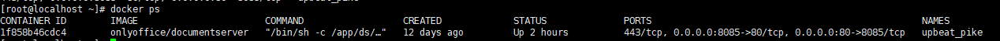

docker 核心组件

- 镜像：镜像是一个只读的静态模板，他保存了容器需要的环境和应用的执行代码，可以将镜像看成是容器的代码，当代码运行起来之后，就成了容器，镜像和容器的关系类似于程序和进程的关系
- 容器：容器是一个运行时环境，是镜像的一个运行状态，它是镜像执行的动态表现
- 库：库是一个特定的用户存储镜像的目录，一个用户可以建立多个库来保存自己的镜像

| command                                                      |                           explain                            | example                                                      |
| ------------------------------------------------------------ | :----------------------------------------------------------: | ------------------------------------------------------------ |
| docker version                                               |                        查看docker版本                        |                                                              |
| docker info                                                  |                      查看docker详细信息                      | docker info --format {{json .}} 以json格式输出docker的详细信息 |
|                                                              |                                                              |                                                              |
| docker images                                                |                        查看docker镜像                        |                                                              |
| docker search tomcat                                         |                    从Docker Hub上查找镜像                    |                                                              |
| docker pull tomcat                                           | 从Docker Hub上下载tomcat镜像。等价于：`docker pull tomcat:latest` |                                                              |
| docker commit -m "提交的描述信息" -a "作者" 容器ID 要创建的目标镜像名称:[标签名] |                提交容器使之成为一个新的镜像。                | 例：如：`docker commit -m "新的tomcat" -a "lizq" f9e29e8455a5 mytomcat:1.2` |
| docker rmi hello-world                                       |                从Docker中删除hello-world镜像                 |                                                              |
| https://www.cnblogs.com/justdojava/p/11271246.html           |                                                              |                                                              |
| docker ps                                                    |                    查看当前正在运行的容器                    |                                                              |
| docker ps -a                                                 |                         查看所有容器                         |                                                              |
| docker ps -l                                                 |                      查看最近创建的容器                      |                                                              |
| docker ps -n = xxx                                           |                    查看最新创建的n个容器                     |                                                              |
|                                                              |                                                              |                                                              |
| docker create                                                |                         创建一个容器                         | docker crate nginx                                           |
| docker create --name='aaa'                                   |                  创建一个容器并且自定义名字                  | docker  create nginx --name 'naginx01' nginx                 |
| docker rm ${docker ps -a 的names}                            |                     单个删除已创建的容器                     | docker rm nginx                                              |
| docker run --name='' -d -p                                   |                                                              |                                                              |
| docker start                                                 | 启动容器，一般第一次启动容器使用docker run,后续使用docker start |                                                              |
| docker ps -a -q                                              |                      列出所有容器的 id                       |                                                              |
| docker stop                                                  |                         终止一个容器                         |                                                              |

- 

  repository:镜像仓库源

  tag:镜像标签

  image id:镜像id 完整的id包括256个比特，由64个十六进制字符组成 

  created:镜像创建时间

  size:镜像大小

  *同一个仓库源可以有多个TAG，表示这个仓库源的不同版本，我们使用REPOSITORY:TAG来定义不同的镜像。如果不指定一个镜像版本标签，例如只使用tomcat，docker将默认使用tomcat:latest镜像*

  docker images --no-trunc 显示完整的镜像信息

  docker images --digests 显示镜像的摘要信息

  docker images -q 只显示镜像ID

- docker search -s 30 tomcat 从Docker Hub上查找关注度大于30的tomcat镜像

- docker rmi -f hello-world`从Docker中强制删除hello-world镜像
  docker rmi -f hello-world nginx`从Docker中强制删除hello-world镜像和nginx镜像
  docker rmi -f $(docker images -p)`通过`docker images -p 查询到的镜像ID来删除所有镜像
  
- 

  - CONTAINER ID:CONTAINER ID是指容器的id，是一个唯一标识符,这是一个64位的十六进制整数，在不会混淆的情况下可以只采用id的前几位进行标识一个容器。
  - IMAGE:IMAGE表示创建容器时使用的镜像。
  - COMMAND:COMMAND表示容器最后运行的命令。
  - CREATED:创建容器的时间。
  - STATUS:容器的状态，这里可能显示一个容器启动时间，也能显示容器关闭时间。具体显示哪个要看容器当前的状态。
  - PORTS:容器对外开放的端口。
  - NAMES:容器的名字，如果不设置，会有一个默认的名字。
  
- 容器创建+启动 docker run

  - 后台型容器：

  ````shell
  docker run --name nginx1 -d -p 8080:80 nginx
  ````

  ​	--name:创建容器的名称。

  ​	-d:容器再后台运行

  ​	-p:将容器的80端口映射到宿主机的8080端口

  ​	首先依然会去本地检查，本地没有相应的容器，则会去 Docker Hub 上查找，查找到了下载并运行，并且生成了一个容器 id。

  - 交互性容器

    ````shell
    docker run --name ubuntu -it ubuntu /bin/bash
    ````

    -it 参数，i 表示开发容器的标准输入（STDIN），t 则表示告诉 docker，为容器创建一个命令行终端。

    

linux文件目录区分：

当为[ d ]则是目录

当为[ - ]则是文件；

若是[ l ]则表示为链接文档(link file)；

若是[ b ]则表示为装置文件里面的可供储存的接口设备(可随机存取装置)；

若是[ c ]则表示为装置文件里面的串行端口设备，例如键盘、鼠标(一次性读取装置)。


将jar包打成镜像

Dockerfile: https://www.cnblogs.com/panwenbin-logs/p/8007348.html#_label0

Dockerfile是一个包含用于组合映像的命令的文本文档。可以使用在命令行中调用任何命令。 **Docker通过读取`Dockerfile`中的指令自动生成映像。**

`docker build`命令用于从Dockerfile构建映像。**可以在`docker build`命令中使用`-f`标志指向文件系统中任何位置的Dockerfile。**

Dockerfile一般分为4个部分

- 基础镜像信息；
- 维护者信息；
- 镜像操作指令；
- 容器启动时执行指令

常用指令：

**FROM**:指定基础镜像，必须为第一个命令

````shell
#格式
FROM <image>
FROM <image>:<tag>
FROM <image>@<digest>
#示列
FROM mysql:5.6
#注：
# tag 或 digest是可选的，如果不使用这两个值时，会使用latest版本的基础镜像
````

**MAINTAINER**:维护者信息

````shell
#格式：
MAINTAINER <name>
#示例：
    MAINTAINER Jasper Xu
    MAINTAINER sorex@163.com
    MAINTAINER Jasper Xu <sorex@163.com>
````

**ADD**：将本地文件添加到容器中，


