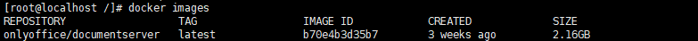

| command                                                      | explain                                                      | example                                                      |
| ------------------------------------------------------------ | ------------------------------------------------------------ | ------------------------------------------------------------ |
| docker version                                               | 查看docker版本                                               |                                                              |
| docker info                                                  | 查看docker详细信息                                           | docker info --format {{json .}} 以json格式输出docker的详细信息 |
|                                                              |                                                              |                                                              |
| docker images                                                | 查看docker镜像                                               |                                                              |
| docker search tomcat                                         | 从Docker Hub上查找镜像                                       |                                                              |
| docker pull tomcat                                           | 从Docker Hub上下载tomcat镜像。等价于：`docker pull tomcat:latest` |                                                              |
| docker commit -m "提交的描述信息" -a "作者" 容器ID 要创建的目标镜像名称:[标签名] | 提交容器使之成为一个新的镜像。                               | 例：如：`docker commit -m "新的tomcat" -a "lizq" f9e29e8455a5 mytomcat:1.2` |
| docker rmi hello-world                                       | 从Docker中删除hello-world镜像                                |                                                              |
|                                                              |                                                              |                                                              |

- 

  repository:镜像仓库源

  tag:镜像标签

  image id:镜像id 完整的id包括256个比特，由64个十六进制字符组成 

  created:镜像创建时间

  size:镜像大小

  *同一个仓库源可以有多个TAG，表示这个仓库源的不同版本，我们使用REPOSITORY:TAG来定义不同的镜像。如果不指定一个镜像版本标签，例如只使用tomcat，docker将默认使用tomcat:latest镜像*

  docker images --no-trunc 显示完整的镜像信息

  docker images --digests 显示镜像的摘要信息

  docker images -q 只显示镜像ID

- docker search -s 30 tomcat 从Docker Hub上查找关注度大于30的tomcat镜像
- docker rmi -f hello-world`从Docker中强制删除hello-world镜像
  docker rmi -f hello-world nginx`从Docker中强制删除hello-world镜像和nginx镜像
  docker rmi -f $(docker images -p)`通过`docker images -p 查询到的镜像ID来删除所有镜像